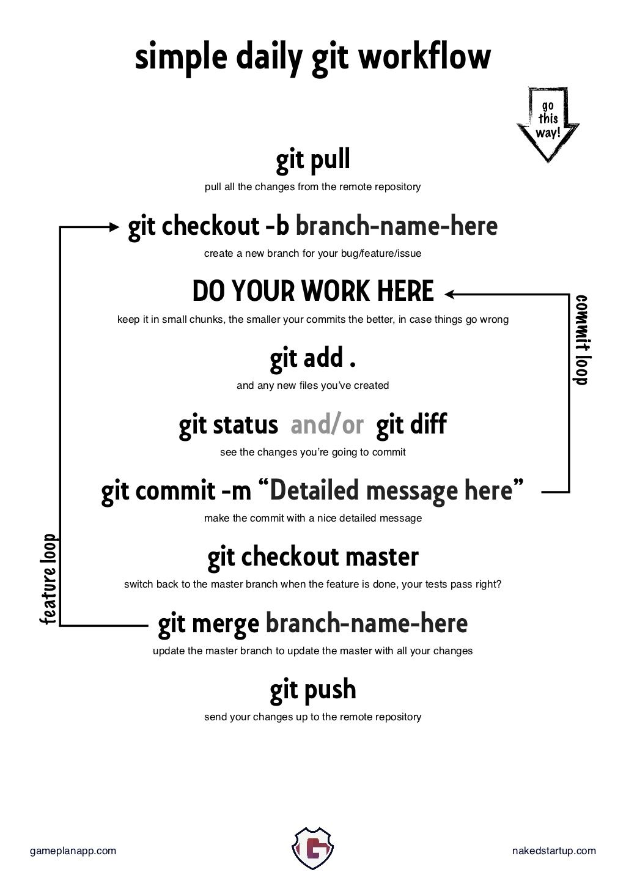

# Procedures

**[↤ Return to Table of Contents](readme.md#table-of-contents)**

## GitHub Workflow

{:height="200px" width="100px"}

### Creating a new analysis branch

1. `git branch Analysis-Name`

### Modifying an ongoing analysis branch

1. Switch to the analysis branch:
    - `git checkout Analysis-Name`
2. Make changes to your code as appropriate.
    - To use existing files: `cp existing-analysis-file new-analysis-file`
3. When your code is complete, or in a good enough spot to save, commit changes to the branch:
    - `git add new-analysis file`
    - `git commit -m "made some changes like blah blah blah"`

### Send your changes to GitHub

- `git push --set-upstream origin Analysis-Name`

When all of your commits are made, back up your analysis branch on GitHub. The analysis branch code doesn't have to be totally complete, but it should be relatively stable. This is necessary if you want to use GitHub issue tracking and code review.

### Open a Pull Request

Once your analysis branch is in a stable state, checked and tested:

1. Open a pull request
    1. Have the code reviewed by project head, discuss, etc.
2. Project head should merge the completed analysis branch into master and delete the analysis branch
3. Finally: update the local repository with newly merged remote master branch
    1. `git checkout master`
    2. `git pull origin master`
    3. `git branch -d analysis-name`

## IRB Submissions

### Huron Research Suite

1. Log in using NID and NID password
    - [Huron IRB Portal](https://ucf1.huronresearchsuite.com/IRB)
2. Address outstanding action items in your inbox
3. Create New Study
    1. Use [new IRB template forms](http://www.research.ucf.edu/compliance/IRB/Investigators/forms.html)
    2. By default, add all present lab members as study personnel.
    3. Add Department Chair and Nichole Lighthall as Ancillary Reviewers

## Recruitment
  
[under construction]

Once a study has been approved by the IRB, we can begin with recruiting participants, and scheduling sessions. Please note in your study's protocol whether your study will be using Sona, LLRN, or any other forms of recruitment.

### Sona

When you would like to recruit younger adults around the UCF campus, utilize Sona for your study's recruitment.

- Review the [Sona guidelines](sourcedocs/sona-guidelines-spring-2019.docx)
- Be sure to follow all [Sona rules](sona-rules.md)

### LLRN Database

Follow [LLRN recruitment procedures](https://llrn.github.io/protocol)

## Scheduling

### Older Adult Participants

[oa research tips](sourcedocs/oa-research-tips.docx)

### Younger Adult Participants

**[↥ Back to Top](#procedures)**